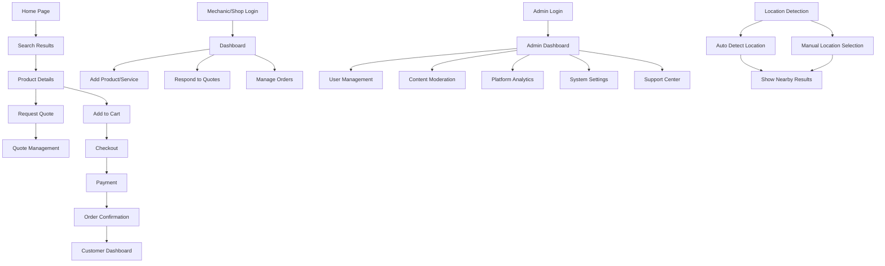

## 1. Product Overview
PARTEX é um marketplace especializado em autopeças que conecta clientes, mecanicos e lojistas em uma plataforma unificada. O sistema permite publicação de peças e serviços, cotações personalizadas e compras online com base em geolocalização.

O produto resolve o problema de dificuldade em encontrar peças específicas e serviços automotivos próximos, criando uma rede local de fornecedores e consumidores. Mecânicos e lojistas aumentam sua visibilidade, enquanto clientes encontram opções próximas com melhores preços.

## 2. Core Features

### 2.1 User Roles
| Role | Registration Method | Core Permissions |
|------|---------------------|------------------|
| Cliente | Email/Social login | Buscar peças, solicitar cotações, comprar produtos, avaliar serviços |
| Mecânico | Email + verificação de certificação | Publicar serviços, responder cotações, vender peças usadas, gerenciar agenda |
| Lojista | Email + CNPJ verification | Gerenciar catálogo de peças, definir preços, atender cotações, gerenciar estoque |
| Admin | Convite do sistema | Gerenciar usuários, moderar conteúdo, visualizar analytics, configurar sistema |

### 2.2 Feature Module
Nosso marketplace PARTEX consiste nas seguintes páginas principais:
1. **Home page**: busca por peças/serviços, mapa com resultados próximos, categorias populares.
2. **Página de Busca**: filtros avançados, resultados por localização, comparação de preços.
3. **Página do Produto**: detalhes da peça/serviço, vendedor próximo, solicitar cotação.
4. **Cotações**: lista de cotações ativas, responder cotações, histórico de cotações.
5. **Carrinho e Checkout**: resumo da compra, opções de entrega, pagamento integrado via Pagar.me.
6. **Dashboard Cliente**: meus pedidos, veículos cadastrados, cotações solicitadas, notificações.
7. **Dashboard Mecânico**: serviços oferecidos, agenda de atendimento, vendas realizadas, notificações.
8. **Dashboard Lojista**: catálogo de produtos, gerenciamento de estoque, relatórios de vendas, notificações.
9. **Painel Admin**: dashboard com métricas em tempo real, gestão de usuários, moderação de produtos, analytics da plataforma, configurações do sistema.
10. **Dashboard Admin Completo**: estatísticas de usuários ativos, transações, volume financeiro, tickets de suporte, gráficos de performance, gestão de adquirentes, serviços, produtos e pagamentos.
11. **Sistema de Localização**: detecção automática de localização, modal de seleção de cidade/estado, geolocalização via GPS, busca por proximidade.
12. **Central de Suporte**: sistema de tickets para usuários, interface de administração para responder solicitações, histórico de conversações.
10. **Central de Notificações**: histórico de notificações, configurações de preferências, marcação como lida.

### 2.3 Page Details
| Page Name | Module Name | Feature description |
|-----------|-------------|---------------------|
| Home page | Hero section | Barra de busca principal com geolocalização automática, categorias de peças populares em cards. |
| Home page | Mapa de resultados | Mapa interativo mostrando mecânicos e lojas próximas com pins coloridos por tipo. |
| Página de Busca | Filtros laterais | Filtrar por tipo (peça/seriviço), distância, preço, marca veículo, ano, modelo. |
| Página de Busca | Resultados | Lista de produtos/serviços com foto, preço, distância, avaliação do vendedor. |
| Página do Produto | Galeria de imagens | Visualização em alta resolução com zoom, múltiplos ângulos da peça. |
| Página do Produto | Informações do vendedor | Card com foto, avaliação, distância, botão de contato direto. |
| Página do Produto | Cotação expressa | Formulário rápido para solicitar cotação com quantidade e observações. |
| Cotações | Lista ativa | Cards com status (pendente/respondida), tempo restante, número de respostas. |
| Cotações | Responder cotação | Formulário para mecânicos/lojistas enviarem proposta com preço e prazo. |
| Carrinho | Resumo da compra | Lista de itens com quantidade, preço unitário, subtotal, frete calculado. |
| Checkout | Pagamento | Integração obrigatória com API Pagar.me, checkout transparente, split de pagamentos, opções de parcelamento, boleto e PIX. |
| Dashboard Cliente | Meus pedidos | Tabela com histórico de compras, status de entrega detalhado (Pendente, Pago, Em Separação, Em Trânsito, Entregue, Cancelado), código de rastreamento, timeline visual de progresso. |
| Dashboard Cliente | Meus veículos | Cadastro de veículos para facilitar busca de peças compatíveis. |
| Dashboard Mecânico | Serviços | CRUD de serviços oferecidos com preços, descrição e tempo estimado. |
| Dashboard Mecânico | Gestão de Entregas | Controlar status de serviços e entregas: Pendente, Pago, Em Separação, Em Trânsito, Entregue, Cancelado. Atualizar cliente sobre progresso. |
| Dashboard Mecânico | Agenda | Calendário com disponibilidade e agendamentos de clientes. |
| Dashboard Lojista | Catálogo | Gerenciar produtos com estoque, preços, fotos e descrições detalhadas. |
| Dashboard Lojista | Gestão de Entregas | Controlar status de pedidos: Pendente, Pago, Em Separação, Em Trânsito, Entregue, Cancelado. Atualizar status de entrega e informar código de rastreamento. |
| Dashboard Lojista | Analytics | Gráficos de vendas, produtos mais vendidos, ticket médio. |
| Painel Admin | Dashboard Principal | Exibir estatísticas de usuários ativos, transações, volume financeiro, tickets abertos com tendências percentuais. |
| Painel Admin | Gestão de Usuários | Listar usuários com busca avançada, filtrar por tipo (cliente/mecânico/loja/admin), status (ativo/pendente/rejeitado), visualizar detalhes, aprovar/rejeitar cadastros. |
| Painel Admin | Moderação de Produtos | Aprovar/rejeitar produtos, gerenciar denúncias, moderar avaliações. |
| Painel Admin | Configurações do Sistema | Editar informações do site (nome, descrição, logos), configurar dados de contato, gerenciar configurações globais da plataforma. |
| Painel Admin | Gestão de Adquirentes | Configurar e gerenciar integrações com gateways de pagamento. |
| Painel Admin | Gestão de Serviços | Administrar categorias e tipos de serviços oferecidos na plataforma. |
| Painel Admin | Gestão de Pagamentos | Visualizar transações, gerenciar reembolsos, acompanhar status de pagamentos. |
| Painel Admin | Central de Suporte | Visualizar e responder tickets de suporte, gerenciar status de atendimento. |
| Sistema de Localização | Detecção Automática | Detectar localização do usuário via IP/GPS ao acessar o site. |
| Sistema de Localização | Modal de Seleção | Interface modal para usuário selecionar cidade e estado manualmente. |
| Sistema de Localização | Indicador de Localização | Exibir localização atual no header com ícone de GPS e nome da cidade. |
| Busca Avançada | Filtros Inteligentes | Filtros por categoria, condição (novo/usado/recondicionado), preço, distância, avaliação. |
| Busca Avançada | Resultados Geolocalizados | Exibir produtos/serviços ordenados por proximidade com distância em km. |
| Header Global | Seletor de Localização | Botão no header para alterar localização com dropdown de cidades recentes. |
| Notificações | Sistema de Badges | Contador de notificações não lidas no ícone de sino do header. |
| Dashboard Layout | Sidebar Responsivo | Menu lateral adaptável com ícones e labels para desktop/tablet, hambúrguer menu para mobile. |
| Central de Notificações | Lista de notificações | Cards com ícone, título, mensagem, timestamp, link para ação relacionada. |
| Central de Notificações | Preferências | Toggle para ativar/desativar tipos de notificações (cotações, pedidos, chat). |
| Header Global | Sino de notificações | Ícone com badge contador de não lidas, dropdown rápido com últimas 5 notificações. |

## 3. Core Process
### Fluxo do Cliente
O cliente acessa a home page e utiliza a busca com geolocalização automática para encontrar peças ou serviços próximos. Pode filtrar resultados por distância, preço e compatibilidade com seu veículo. Ao encontrar um produto de interesse, visualiza detalhes e pode solicitar cotação ou comprar diretamente. No checkout, escolhe forma de pagamento e entrega. Após compra, acompanha status pelo dashboard.

### Fluxo do Mecânico/Lojista
Mecânicos e lojistas se cadastram com documentação específica. Após aprovação, publicam seus produtos e serviços com fotos, descrições e preços. Recebem notificações de cotações solicitadas próximas à sua localização. Respondem com propostas personalizadas. Gerenciam pedidos e vendas através do dashboard específico.

### Fluxo Administrativo
Administradores acessam o dashboard completo com métricas em tempo real de usuários, transações, volume financeiro e tickets. Podem gerenciar usuários com busca avançada e filtros, aprovar/rejeitar cadastros, moderar produtos e avaliações. Acesso à central de suporte para responder tickets dos usuários e configurações globais do sistema para personalizar informações da plataforma.

### Fluxo de Localização
Ao acessar o site, a localização é detectada automaticamente via IP/GPS. O usuário pode alterar a localização através do seletor no header, abrindo um modal com lista de cidades ou busca manual. A localização selecionada afeta todos os resultados de busca, mostrando produtos e serviços ordenados por proximidade.



## 4. User Interface Design
### 4.1 Design Style
- **Cores Primárias**: #F26522 (laranja vibrante para CTAs e botões de ação)
- **Cores Secundárias**: #FFFFFF (fundo limpo e cards de produtos)
- **Destaque Escuro**: #1A242B (header, navegação e elementos de contraste)
- **Neutro de Apoio**: #E1E8ED (bordas, inputs e divisores sutis)
- **Texto**: #4A4A4A (texto principal com boa legibilidade)
- **Botões**: Estilo arredondado com sombra sutil, hover com 10% de escurecimento
- **Fontes**: Inter para textos, Montserrat para títulos principais
- **Layout**: Card-based com grid responsivo, navegação superior fixa
- **Ícones**: Estilo outlined com peso médio, consistente com design moderno

### 4.2 Page Design Overview
| Page Name | Module Name | UI Elements |
|-----------|-------------|-------------|
| Home page | Hero section | Barra de busca grande com ícone de localização, botão laranja #F26522 para "Buscar Peças", fundo branco #FFFFFF. |
| Home page | Mapa interativo | Mapa com pins coloridos: laranja para mecânicos, azul para lojas, popup com informações ao clicar. |
| Search Results | Cards de produto | Card branco com borda #E1E8ED, imagem 16:9, preço em laranja #F26522, botão de ação primário. |
| Product Details | Galeria de imagens | Carousel com thumbnails horizontais, zoom on hover, indicadores de navegação no header escuro #1A242B. |
| Dashboard | Navigation sidebar | Menu lateral escuro #1A242B com ícones brancos, hover com background #F26522, fonte Inter 14px. |
| Dashboard | Cards métricas | Cards brancos com ícone colorido, número grande em laranja #F26522, label em #4A4A4A, sombra sutil. |

### 4.3 Responsiveness (Requisito Crítico)
**Design Mobile-First e Responsivo - Requisito Não Funcional Crítico**

O sistema PARTEX deve ser totalmente responsivo e mobile-first, garantindo experiência otimizada em todos os dispositivos:

**Mobile-First Approach:**
- Desenvolvimento iniciado para dispositivos móveis (320px) e progressivo enhancement para tablets e desktop
- Breakpoints principais: 480px (mobile), 768px (tablet), 1024px (desktop), 1440px (large desktop)
- Touch-first design com áreas de toque mínimas de 44px x 44px
- Gestos nativos: swipe para navegação, pull-to-refresh, pinch-to-zoom em imagens

**Otimização Mobile Específica:**
- Navegação inferior fixa com ícones grandes e labels claros
- Menu hambúrguer com animações suaves e acessibilidade completa
- Cards empilhados verticalmente com scroll infinito
- Filtros em modal lateral deslizante (drawer) com backdrop semitransparente
- Formulários com campos grandes e teclado otimizado (tipo de input apropriado)
- Botões de ação flutuante (FAB) para ações primárias
- Lazy loading de imagens com placeholder skeleton
- Compressão e otimização automática de assets para mobile

**Performance Mobile:**
- First Contentful Paint < 1.5s em 3G
- Time to Interactive < 3.5s em dispositivos médios
- Bundle size otimizado com code splitting por rotas
- Implementação de service workers para funcionalidade offline parcial
- Cache inteligente de imagens e dados frequentemente acessados

**Testes e Validação:**
- Testes em dispositivos reais (iOS Safari, Android Chrome)
- Validação com Lighthouse Score > 90 em mobile
- Testes de usabilidade com usuários em smartphones
- Verificação de contraste e acessibilidade WCAG 2.1 AA em telas pequenas

### 4.4 Geolocalização Interface
Interface de geolocalização com mapa interativo utilizando Mapbox ou Google Maps, com pins personalizados na cor da marca (#F26522) para diferenciar PARTEX de outros mapas. Barra de busca com autocomplete de endereços, botão "Minha localização" com ícone de GPS. Área de raio de busca visual com círculo semi-transparente.

### 4.5 Diretrizes de Design Responsivo (Requisitos Técnicos)

**Componentes Adaptáveis:**
- **Grid System**: Tailwind CSS com container queries para layouts fluidos
- **Typography**: Escala tipográfica responsiva com clamp() para tamanhos adaptativos
- **Spacing**: Sistema de espaçamento baseado em rem com multiplicadores responsivos
- **Imagens**: Picture element com srcset para otimização automática por densidade de pixels
- **Navigation**: Transformação automática entre top nav (desktop) e bottom nav (mobile)

**Breakpoints e Componentes:**
```
// Mobile-first breakpoints
sm: 480px  // Smartphones em portrait
md: 768px  // Tablets e smartphones em landscape  
lg: 1024px // Desktop pequeno e tablets grandes
xl: 1440px // Desktop padrão
2xl: 1920px // Desktop grande
```

**Estados de Componentes Mobile:**
- **Loading**: Skeleton screens otimizados para mobile
- **Empty**: Ilustrações SVG leves e mensagens curtas
- **Error**: Mensagens compactas com ações claras e botões grandes
- **Success**: Feedback visual imediato com animações sutis

**Performance Budget Mobile:**
- JavaScript bundle: < 200KB gzipped
- CSS: < 50KB gzipped  
- Imagens: WebP com fallback para JPEG/PNG
- Fontes: Variable fonts com subset em latim
- Critical CSS inline para first render < 1s

## 5. Estratégia de Desenvolvimento

### 5.1 Roadmap de Implementação

O projeto PARTEX será executado estritamente em duas fases sequenciais para garantir qualidade e foco em cada etapa:

#### **Fase 1: Frontend (Interface e Experiência do Usuário)**
**Objetivo**: Desenvolvimento completo da interface, fluxos de navegação e componentes visuais.

**Escopo desta fase**:
- Implementação completa de todas as páginas e componentes React
- Desenvolvimento do design system com Tailwind CSS
- Criação de todos os fluxos de navegação e interações
- Implementação de estados de loading, error e empty states
- Mock de dados para simular funcionalidades completas
- Testes de usabilidade e ajustes de UX
- Otimização de performance e responsividade

**Tecnologias foco**: React 18, Vite, Tailwind CSS, React Hook Form, Zustand

**Requisitos Mobile-First Específicos da Fase 1:**
- Desenvolvimento mobile-first: todos os componentes iniciam no breakpoint mínimo (320px)
- Implementação de viewport meta tag otimizada para mobile
- Touch events e gestures com react-use-gesture ou similar
- Lazy loading com React.lazy() e Suspense para otimização mobile
- Implementação de Progressive Web App (PWA) features básicas
- Testes em devices reais via BrowserStack ou similar
- Validação contínua com Lighthouse CI para performance mobile

#### **Fase 2: Backend e Integrações (Funcionalidades e Dados Reais)**
**Objetivo**: Implementação do backend, integrações com serviços externos e substituição dos mocks por dados reais.

**Escopo desta fase**:
- Configuração e implementação do Supabase (Auth, Database, Realtime)
- Integração com API Pagar.me para pagamentos
- Implementação de lógica de negócios e regras de negócio
- Substituição completa dos mocks por integrações reais
- Implementação de notificações em tempo real
- Configuração de políticas de segurança e acesso
- Testes de integração e end-to-end
- Deploy e monitoramento

**Tecnologias foco**: Supabase, Pagar.me API, PostgreSQL, Redis (cache)

### 5.2 Critérios de Transição entre Fases

A transição da Fase 1 para Fase 2 ocorrerá apenas após:
- ✅ Aprovação completa da interface e experiência do usuário
- ✅ Todos os componentes e páginas implementados com mocks
- ✅ Testes de usabilidade realizados e ajustes aplicados
- ✅ Documentação de integrações preparada
- ✅ Ambiente de desenvolvimento backend configurado

### 5.3 Requisitos Não-Funcionais Mobile-First (Críticos)

**Performance Mobile Obrigatória:**
- First Contentful Paint (FCP) < 1.5s em conexão 3G lenta
- Largest Contentful Paint (LCP) < 2.5s em dispositivos mid-range
- First Input Delay (FID) < 100ms para interações principais
- Cumulative Layout Shift (CLS) < 0.1 para estabilidade visual
- Bundle size total < 500KB gzipped para mobile

**Compatibilidade de Dispositivos:**
- Suporte para iOS Safari 12+ e Android Chrome 80+
- Testes obrigatórios em iPhone SE (375px) e Galaxy S20 (360px)
- Funcionalidade degradada gracefully em dispositivos com 1GB RAM
- Suporte para modo offline parcial (cache de páginas visitadas)

**Acessibilidade Mobile:**
- WCAG 2.1 AA compliance em telas de 4.7 polegadas
- Tamanho mínimo de toque: 44x44px (Apple HIG)
- Suporte completo para leitores de tela (VoiceOver, TalkBack)
- Navegação por teclado virtual otimizada
- Modos de alto contraste e fontes grandes do sistema

**Experiência de Usuário Mobile:**
- Nenhum scroll horizontal em orientação portrait
- Botões e links com área de toque visível e feedback tátil
- Formulários com autocomplete e teclados contextuais
- Prevenção de zoom acidental em inputs
- Suporte para orientação portrait e landscape

### 5.4 Benefícios da Abordagem por Fases

1. **Foco e Qualidade**: Cada equipe pode se concentrar em sua especialidade sem dependências cruzadas
2. **Validação Antecipada**: Interface pode ser testada e ajustada antes da integração
3. **Redução de Risco**: Problemas de UX são identificados antes de investir em backend
4. **Escalabilidade**: Backend é projetado com conhecimento completo das necessidades da interface
5. **Entrega Contínua**: Frontend funcional pode ser demonstrado mesmo com dados mockados

## 6. Histórico de Atualizações

### 26 de Fevereiro de 2026 - Sprint de Otimização e Features Avançadas

**Sistema de Localização:**
- Implementação do `LocationContext` com detecção automática (Google Maps/Nominatim)
- Modal de seleção manual com autocomplete e persistência de dados
- Indicador visual de localização no header com exibição inteligente

**Admin Dashboard:**
- Integração real com Supabase (Counts de usuários, transações, tickets)
- Correção de layout (largura mínima) e tabelas de gestão
- Dashboard com métricas em tempo real e gráficos de performance

**Busca (Search):**
- Adição de input de busca dedicado com filtros por Tipo (Peças/Serviços)
- Melhoria na UX de filtros mobile/desktop
- Resultados geolocalizados ordenados por proximidade

**Home Page:**
- Redesign da seção de categorias (lista horizontal scrollável)
- Lógica de ocultação do card de login para usuários autenticados
- Layout otimizado para mobile-first

**Header:**
- Menu desktop atualizado (Home, Busca, Cotar, Favoritos, Sobre)
- Dropdown de usuário com lógica Admin/User
- Exibição inteligente de endereço com base na localização

**Limpeza e Polimento:**
- Remoção de referências ao Trae
- Atualização de Favicon e Copyright do footer
- Otimizações de performance e responsividade

### Janeiro - Fevereiro 2026 - Fase Inicial

**Configuração Inicial:**
- Setup do projeto com Vite + React
- Configuração do ambiente de desenvolvimento
- Estruturação inicial do repositório

**Estruturação de Rotas e Layouts:**
- Implementação do DashboardLayout responsivo
- Sistema de roteamento com React Router
- Componentes de layout reutilizáveis

**Autenticação com Supabase:**
- Sistema de Login/Register completo
- Integração com Supabase Auth
- Proteção de rotas e gerenciamento de sessão

**Criação das Páginas Base:**
- Home page com busca e categorias
- Services page com listagem de serviços
- ProductDetails com galeria de imagens
- Estrutura inicial dos dashboards por tipo de usuário