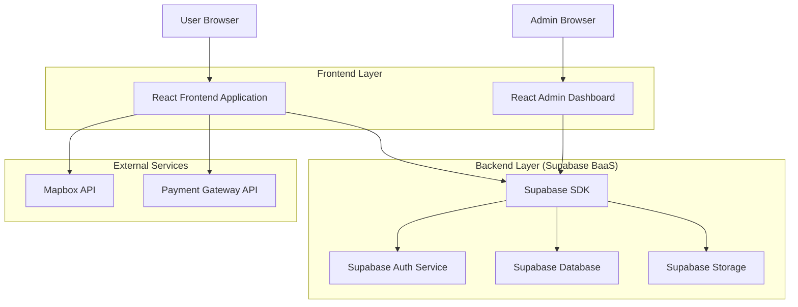
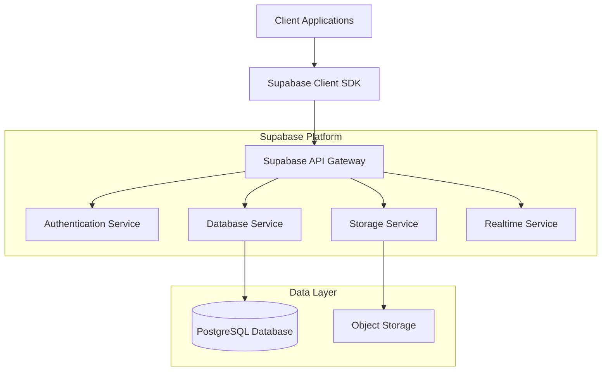
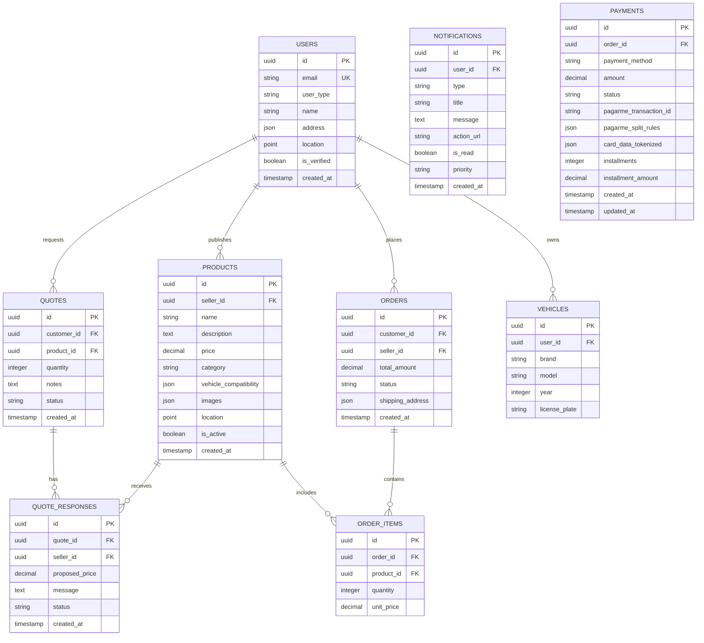

## 1. Architecture design


## 2. Technology Description
- Frontend: React@18 + tailwindcss@3 + vite
- Initialization Tool: vite-init
- Backend: Supabase (BaaS)
- Database: PostgreSQL (via Supabase)
- Authentication: Supabase Auth
- File Storage: Supabase Storage
- Maps Integration: Mapbox GL JS
- Payment Processing: Stripe API
- State Management: React Context + useReducer
- Geolocation: Browser Geolocation API + Mapbox
- Real-time Notifications: Supabase Realtime (WebSocket)
- Notification UI: React-hot-toast + custom notification bell component

## 3. Route definitions
| Route | Purpose |
|-------|---------|
| / | Home page com busca principal e mapa de resultados |
| /search | Página de resultados com filtros e lista de produtos/serviços |
| /product/:id | Detalhes do produto ou serviço com galeria e informações do vendedor |
| /cart | Carrinho de compras com resumo e cálculo de frete |
| /checkout | Processo de checkout com pagamento e endereço |
| /login | Página de login para todos os tipos de usuários |
| /register | Cadastro com seleção de tipo de usuário (cliente/mecânico/lojista) |
| /dashboard | Dashboard principal redireciona baseado no tipo de usuário |
| /dashboard/customer | Dashboard do cliente com pedidos e veículos |
| /dashboard/mechanic | Dashboard do mecânico com serviços e agenda |
| /dashboard/shop | Dashboard do lojista com catálogo e vendas |
| /admin | Painel administrativo com gestão da plataforma |
| /quotes | Sistema de cotações para clientes e fornecedores |
| /profile | Perfil do usuário com informações e configurações |

## 4. API definitions

### 4.1 Authentication APIs
```
POST /auth/v1/token
```
Request:
```json
{
  "email": "user@example.com",
  "password": "securepassword",
  "type": "customer|mechanic|shop"
}
```

### 4.2 Product APIs
```
GET /rest/v1/products
POST /rest/v1/products
PUT /rest/v1/products/:id
DELETE /rest/v1/products/:id
```

Query Parameters:
| Param Name | Param Type | isRequired | Description |
|------------|-------------|-------------|-------------|
| lat | number | false | Latitude para busca por proximidade |
| lng | number | false | Longitude para busca por proximidade |
| radius | number | false | Raio de busca em km (default: 10) |
| category | string | false | Categoria da peça/serviço |
| price_min | number | false | Preço mínimo |
| price_max | number | false | Preço máximo |
| vehicle_brand | string | false | Marca do veículo |
| vehicle_model | string | false | Modelo do veículo |
| vehicle_year | number | false | Ano do veículo |

### 4.3 Quote APIs
```
POST /rest/v1/quotes
GET /rest/v1/quotes
PUT /rest/v1/quotes/:id/respond
```

Request:
```json
{
  "product_id": "uuid",
  "quantity": 1,
  "notes": "Preciso urgente",
  "delivery_preference": "pickup|delivery"
}
```

### 4.4 Notification APIs
```
POST /rest/v1/notifications
GET /rest/v1/notifications
PUT /rest/v1/notifications/:id/read
PUT /rest/v1/notifications/mark-all-read
```

Request:
```json
{
  "user_id": "uuid",
  "type": "quote|order|message|system",
  "title": "Nova cotação recebida",
  "message": "Você recebeu uma resposta para sua cotação",
  "action_url": "/quotes/123",
  "priority": "high|medium|low"
}
```

### 4.4 Order APIs
```
POST /rest/v1/orders
GET /rest/v1/orders
PUT /rest/v1/orders/:id/status
```

## 5. Server architecture diagram


## 6. Data model

### 6.1 Data model definition


### 6.2 Data Definition Language

Users Table
```sql
CREATE TABLE users (
  id UUID PRIMARY KEY DEFAULT gen_random_uuid(),
  email VARCHAR(255) UNIQUE NOT NULL,
  user_type VARCHAR(20) NOT NULL CHECK (user_type IN ('customer', 'mechanic', 'shop', 'admin')),
  name VARCHAR(255) NOT NULL,
  phone VARCHAR(20),
  address JSONB,
  location GEOGRAPHY(POINT, 4326),
  is_verified BOOLEAN DEFAULT FALSE,
  document_url TEXT,
  rating DECIMAL(2,1) DEFAULT 0,
  total_reviews INTEGER DEFAULT 0,
  created_at TIMESTAMP WITH TIME ZONE DEFAULT NOW(),
  updated_at TIMESTAMP WITH TIME ZONE DEFAULT NOW()
);

-- Enable PostGIS
CREATE EXTENSION IF NOT EXISTS postgis;

-- Indexes
CREATE INDEX idx_users_location ON users USING GIST (location);
CREATE INDEX idx_users_type ON users(user_type);
CREATE INDEX idx_users_verified ON users(is_verified);
```

Products Table
```sql
CREATE TABLE products (
  id UUID PRIMARY KEY DEFAULT gen_random_uuid(),
  seller_id UUID REFERENCES users(id) ON DELETE CASCADE,
  name VARCHAR(255) NOT NULL,
  description TEXT,
  price DECIMAL(10,2),
  category VARCHAR(100),
  condition VARCHAR(20) CHECK (condition IN ('new', 'used', 'refurbished')),
  vehicle_compatibility JSONB,
  images JSONB,
  location GEOGRAPHY(POINT, 4326),
  is_active BOOLEAN DEFAULT TRUE,
  stock_quantity INTEGER DEFAULT 1,
  views INTEGER DEFAULT 0,
  created_at TIMESTAMP WITH TIME ZONE DEFAULT NOW(),
  updated_at TIMESTAMP WITH TIME ZONE DEFAULT NOW()
);

CREATE INDEX idx_products_seller ON products(seller_id);
CREATE INDEX idx_products_location ON products USING GIST (location);
CREATE INDEX idx_products_category ON products(category);
CREATE INDEX idx_products_active ON products(is_active);
```

Quotes Table
```sql
CREATE TABLE quotes (
  id UUID PRIMARY KEY DEFAULT gen_random_uuid(),
  customer_id UUID REFERENCES users(id) ON DELETE CASCADE,
  product_id UUID REFERENCES products(id) ON DELETE CASCADE,
  quantity INTEGER NOT NULL DEFAULT 1,
  notes TEXT,
  delivery_preference VARCHAR(20) CHECK (delivery_preference IN ('pickup', 'delivery', 'both')),
  status VARCHAR(20) DEFAULT 'pending' CHECK (status IN ('pending', 'responded', 'expired')),
  expires_at TIMESTAMP WITH TIME ZONE DEFAULT NOW() + INTERVAL '3 days',
  created_at TIMESTAMP WITH TIME ZONE DEFAULT NOW()
);

CREATE INDEX idx_quotes_customer ON quotes(customer_id);
CREATE INDEX idx_quotes_product ON quotes(product_id);
CREATE INDEX idx_quotes_status ON quotes(status);
```

Orders Table
```sql
CREATE TABLE orders (
  id UUID PRIMARY KEY DEFAULT gen_random_uuid(),
  customer_id UUID REFERENCES users(id) ON DELETE CASCADE,
  seller_id UUID REFERENCES users(id) ON DELETE CASCADE,
  total_amount DECIMAL(10,2) NOT NULL,
  status VARCHAR(20) DEFAULT 'pending' CHECK (status IN ('pending', 'paid', 'processing', 'shipped', 'delivered', 'cancelled')),
  shipping_address JSONB,
  pagarme_transaction_id VARCHAR(100),
  pagarme_metadata JSONB,
  tracking_code VARCHAR(50),
  estimated_delivery_date DATE,
  delivery_status VARCHAR(30) DEFAULT 'pending' CHECK (delivery_status IN ('pending', 'paid', 'processing', 'separation', 'transit', 'delivered', 'cancelled')),
  delivery_updated_at TIMESTAMP WITH TIME ZONE,
  delivery_updated_by UUID REFERENCES users(id),
  created_at TIMESTAMP WITH TIME ZONE DEFAULT NOW(),
  updated_at TIMESTAMP WITH TIME ZONE DEFAULT NOW()
);

CREATE INDEX idx_orders_customer ON orders(customer_id);
CREATE INDEX idx_orders_seller ON orders(seller_id);
CREATE INDEX idx_orders_status ON orders(status);
CREATE INDEX idx_orders_delivery_status ON orders(delivery_status);
CREATE INDEX idx_orders_pagarme ON orders(pagarme_transaction_id);
```

Row Level Security (RLS) Policies
```sql
-- Enable RLS
ALTER TABLE users ENABLE ROW LEVEL SECURITY;
ALTER TABLE products ENABLE ROW LEVEL SECURITY;
ALTER TABLE quotes ENABLE ROW LEVEL SECURITY;

-- Users policies
CREATE POLICY "Users can view all active users" ON users
  FOR SELECT USING (is_verified = TRUE OR user_type = 'admin');

CREATE POLICY "Users can update own profile" ON users
  FOR UPDATE USING (auth.uid() = id);

-- Products policies  
CREATE POLICY "Anyone can view active products" ON products
  FOR SELECT USING (is_active = TRUE);

CREATE POLICY "Sellers can manage own products" ON products
  FOR ALL USING (auth.uid() = seller_id);

-- Quotes policies
CREATE POLICY "Customers can create quotes" ON quotes
  FOR INSERT WITH CHECK (auth.uid() = customer_id);

CREATE POLICY "Users can view own quotes" ON quotes
  FOR SELECT USING (auth.uid() = customer_id);

CREATE POLICY "Sellers can view quotes for their products" ON quotes
  FOR SELECT USING (EXISTS (
    SELECT 1 FROM products 
    WHERE products.id = quotes.product_id 
    AND products.seller_id = auth.uid()
  ));

-- Orders policies
CREATE POLICY "Users can view own orders" ON orders
  FOR SELECT USING (auth.uid() = customer_id OR auth.uid() = seller_id);

CREATE POLICY "Customers can create orders" ON orders
  FOR INSERT WITH CHECK (auth.uid() = customer_id);

CREATE POLICY "Sellers can update order status" ON orders
  FOR UPDATE USING (auth.uid() = seller_id);

CREATE POLICY "Sellers can update delivery status" ON orders
  FOR UPDATE USING (auth.uid() = seller_id AND delivery_updated_by = auth.uid());

-- Notifications table
CREATE TABLE notifications (
  id UUID PRIMARY KEY DEFAULT gen_random_uuid(),
  user_id UUID REFERENCES users(id) ON DELETE CASCADE,
  type VARCHAR(20) NOT NULL CHECK (type IN ('quote', 'order', 'message', 'system')),
  title VARCHAR(255) NOT NULL,
  message TEXT,
  action_url TEXT,
  is_read BOOLEAN DEFAULT FALSE,
  priority VARCHAR(10) DEFAULT 'medium' CHECK (priority IN ('high', 'medium', 'low')),
  created_at TIMESTAMP WITH TIME ZONE DEFAULT NOW()
);

CREATE INDEX idx_notifications_user ON notifications(user_id);
CREATE INDEX idx_notifications_read ON notifications(is_read);
CREATE INDEX idx_notifications_created ON notifications(created_at DESC);

-- Notifications policies
CREATE POLICY "Users can view own notifications" ON notifications
  FOR SELECT USING (auth.uid() = user_id);

CREATE POLICY "Users can update own notifications" ON notifications
  FOR UPDATE USING (auth.uid() = user_id);

-- Grant permissions
GRANT SELECT ON notifications TO anon;
GRANT ALL PRIVILEGES ON notifications TO authenticated;
```

### 6.3 Supabase Storage Configuration
```sql
-- Create storage buckets
INSERT INTO storage.buckets (id, name, public) VALUES 
('product-images', 'product-images', true),
('user-documents', 'user-documents', false),
('service-images', 'service-images', true);

-- Storage policies
CREATE POLICY "Anyone can view product images" 
ON storage.objects FOR SELECT 
USING (bucket_id = 'product-images');

CREATE POLICY "Users can upload own documents"
ON storage.objects FOR INSERT 
WITH CHECK (bucket_id = 'user-documents' AND auth.uid()::text = (storage.foldername(name))[1]);

-- Realtime notifications configuration
ALTER TABLE notifications ENABLE ROW LEVEL SECURITY;

CREATE POLICY "Users can receive realtime notifications" ON notifications
  FOR SELECT USING (auth.uid() = user_id);

-- Function to send notification
CREATE OR REPLACE FUNCTION send_notification(
  target_user_id UUID,
  notification_type VARCHAR(20),
  notification_title VARCHAR(255),
  notification_message TEXT,
  notification_action_url TEXT DEFAULT NULL,
  notification_priority VARCHAR(10) DEFAULT 'medium'
)
RETURNS UUID AS $$
DECLARE
  notification_id UUID;
BEGIN
  INSERT INTO notifications (user_id, type, title, message, action_url, priority)
  VALUES (target_user_id, notification_type, notification_title, notification_message, notification_action_url, notification_priority)
  RETURNING id INTO notification_id;
  
  RETURN notification_id;
END;
$$ LANGUAGE plpgsql SECURITY DEFINER;
```